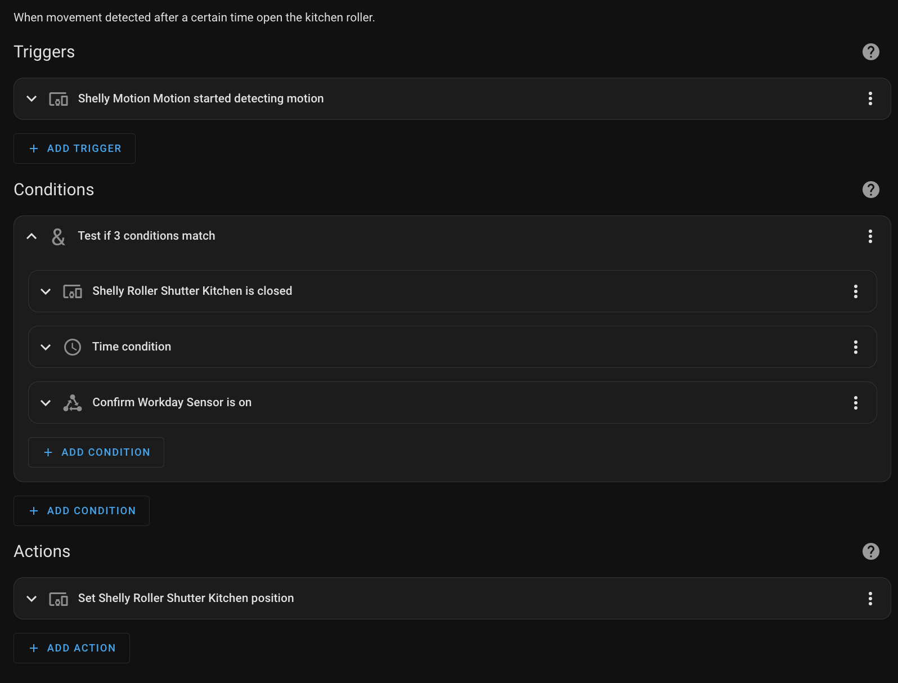

# Automations

The automation part of the HA is where its power resides. [Automations](https://www.home-assistant.io/docs/automation/basics/) allow us to to conduct actions based on various sensors and condition. 

Each automation is consisted of 3 distinct part: **trigger(s) | condition(s) | action(s)**. Triggers describe events that should trigger the automation rule. Conditions are optional tests that can limit an automation rule to only work in your specific use cases. The third part is the action, which will be performed when a rule is triggered and all conditions are met.

For instance in the following automation when a specific motion sensor senses any kind of motion 3 conditions will be checked for validity. If the kitchen roller is closed, and time is between a range (e.g 7:00-8:00 AM) and it's a weekday then the action that will be performed is to set the roller shutter position to open.. 

It is clear that it is pretty useful to use data based on current date and time conditions within our automations. There is an abundant of available condition of this kind which are available to triggers and condition within the automations. 
Apart the already existing ones we can add other through the [HA integrations](https://www.home-assistant.io/integrations). 

While automations is a great way to automate things in our home it requires extra caution when multiple automations can control the same device as we might have weird behavior due to conflicting states.

## Scenes

[HA Scenes](https://www.home-assistant.io/integrations/scene/) allows us to create scenes that capture the states you want certain entities to be. 

For example, a scene can specify that light A should be turned on and light B should be bright red. Scenes can be created and managed via the user interface using the Scene Editor. Another example is when we want to open or close all the roller shutter of a home.