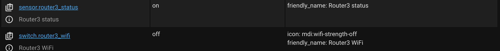
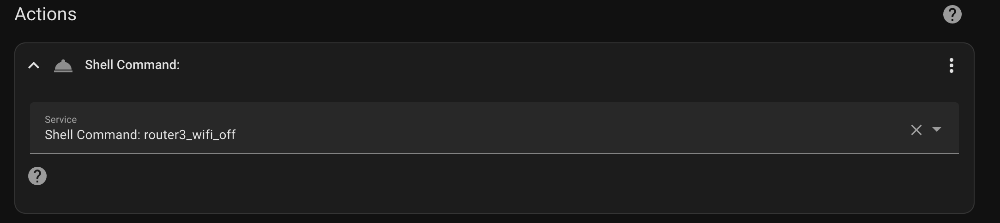

# Custom Scripts

There are lots of devices that cannot be integrated with the Home Assistant as there is no available service for that. In my case I had an old router that I would like to check is WiFi state and also manage it (turn it off and on).

So the solution came through a custom CLI app I developed which can retrieve information and edit some basic options of the router. The CLI's interface if pretty straightforward. Executing the `gorapi` binary with different arguments perfoms a different operation:

```
./gorapi --device router3 --command wifi_status  #returns wifi status on|off
./gorapi --device router3 --command wifi_on  #returns wifi on
./gorapi --device router3 --command wifi_off  #returns wifi off
```

In order to integrate with home assistand, the binary ws placed at the `/root/config` path and added within the `configuration.yaml` file the following lines:

```
switch:
  - platform: command_line
    switches:
      router3_wifi:
        command_state: "./gorapi --device router3 --command wifi_status"
        command_on: "./gorapi --device router3 --command wifi_on"
        command_off: "./gorapi --device router3 --command wifi_off"
        value_template: '{{ value == "on" }}'
        friendly_name: Router3 WiFi
        icon_template: >-
          
            mdi:wifi-strength-4
          
            mdi:wifi-strength-off
          

sensor:
  - platform: command_line
    name: Router3 status
    command: "./gorapi --device router3 --command status"
    value_template: "{{ value }}"

shell_command:
  router3_wifi_on: "./gorapi --device router3 --command wifi_on"
  router3_wifi_off: "./gorapi --device router3 --command wifi_off"
```

The `switch` and `sensor` entries allowed us to access the offered functionality as a normal device:



The `shell_command` entry allowed us to use the provided commands within any automation.


