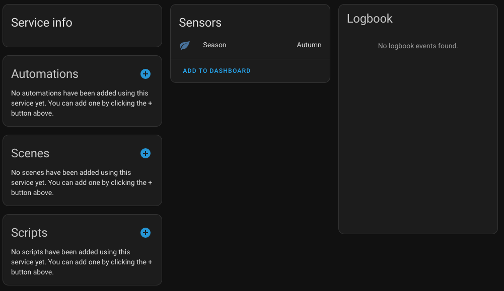

# Devices & Sensors

Here is a list of devices the Home assistant discovered just right after its setup:

* Smart TV
* ISP's Modem
* Printer(s) state

> These devices must be at the same network with the HA so that they can be integrated.

Here is an example of an auto-discovered and integrated printer:

Other existing devices can be integrated to HA by adding as a Device from the `Configuration`->`Integrations` page.
Integrations do not require some kind of sensor or actuator. There are integrations that provide information about the current weather (fetched from some online service), the current season or the local holidays.

## Shelly Sensors

Apart from this kind of devices, other smart devices can be integrated manually. For instance, a shelly Humidity & Temperature senor can be integrated and used within the HA after its proper setup.

In order to integrate a device with HA various steps have to be done. This process depend on the device's manufacturer and model but in general most of the setup process is common. Most of the sensors (especially the Shellys) provide an integrated web UI that allows us to set up the sensor by connecting to its WiFi network. 

For a Shelly smart plug, we have to setup the WiFi network where it is going to be connected and then enable the CoIoT protocol by providing the IP of the HA host at port `5683` (e.g. `192.168.2.1:5683`). CoIoT is another protocol for IoT communication and integration. Connection Shelly devices through this protocol instead of MQTT allows HA to provider a wider set of options for such integrations.

While, device it's self offer some actions to be setup within its interface, I would highly recommend using the [automations](/automations) capabilities of HA. Using this way all control logic will be within a single point making it easier for review and management. However, each device might  have some options that we would like to be integrated in it so that when something is not working as expected to protect our equipment. Also, some of these options might not be available through the HA integration.

## Sensors/Actuators

A pretty common sensor/actuator are the relays. These kind of devices allow us to control other electric devices in our house from the HA. While these devices are pretty useful they require some kind of hardware setup. These devices can be found if form of smart switches that require changing our existing switches, or in form of a smart relay which require to interfere them between the device and our existing switch.

The first kind of actuators are wall switches and require to replace our existing ones. These switches can be connected to our local network through WiFi and be integrated with the HA.

Another Kind of actuators are relays that can be placed within the wall box behind the switch. These kind of relays interfere between the device and the switch. Then, they can control the connected device and also sense the switch's position in order to change the device's status based on the switch placement too. Such devices are 

More details about the setup of the in wall switches can be found at the [Switch Setup](./switch-setup) page.

## Home Assistant Community Store

Home Assistant Community Store or [HACS](https://hacs.xyz/) is a HA integration that provides access to even more new custom element within the HA UI. There are several elements that are widely used and can provide HA with extra functionality.
