# Switch Setup

## Thermostat

The reason for adding a smart switch to the existing thermostat is to manage the thermostat using various conditions. The device I used as a smart switch was a [Shelly 1L](https://www.shelly.cloud/en/products/shop/shelly-1l). This device allows the conversion of any existing wall switch into a smart switch without changing the wiring or running new cables. In my case, I interfere the switch between the thermostat and the radiators' boiler. The connection diagram is as follows and in the role of the switch is the existing thermostat:

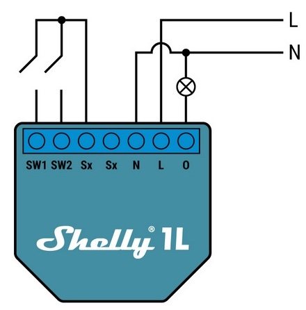
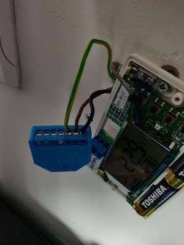

> In the second image, the switch (thermostat) is not yet connected.

After proper setup of the WiFi of the device alongside the CoIoT service it's good to update its firmware if there is and internet connection available. Then we had to configure its settings. Most of the setting has to do with the actual switch and the device's state after a power outage.


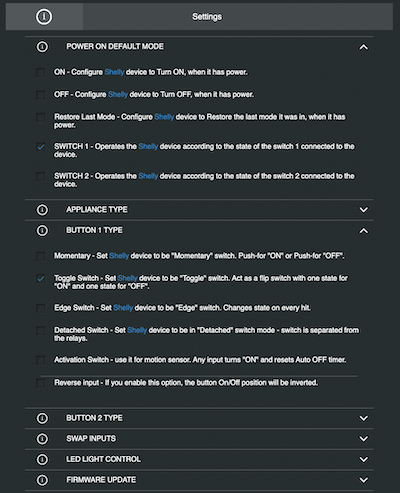

In order to properly set it up within the HA we had to add the new device at the Devices section within the settings. In the dashboard we can add a simple switch where we can see it's status and also change it.


While this is sometimes useful (mainly to examine its status), it's not so convenient in managing the thermostat. We would like the thermostat to work based on the current temperature. This can be configured within the HA as long as we have added some kind of temperature sensor. The [climate integration](https://www.home-assistant.io/integrations/climate/) of HA provides this functionality and can be configured within the `configuration.yaml` file:

```yaml
climate:
  - platform: generic_thermostat
    name: Heaters
    heater: switch.thermostat
    target_sensor: sensor.shellyflowerht_temperature
    unique_id: central_heating
    min_temp: 15
    max_temp: 25
    target_temp: 25
    min_cycle_duration:
      minutes: 5
```

> `sensor.shellyflowerht_temperature` is the sensor that provides the current temperature

We can now add the climate panel in any dashboard:

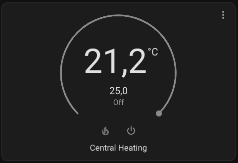
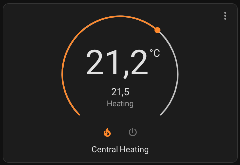

Apart from the HA that can control the radiators' boiler, switch can also sense the thermostat's state and act according to each command. So, we are able to control the device from both the thermostat and the smart switch through HA.

## Roller Shutter

Roller shutters are a bit different compared to the simple switches. The main reason is that each roller shutter is consisted of two separate buttons each one having two state. Also there are various kind of roller shutter switches (momentary, toggle etc). So, we need some special switches that provide us these type of functionalities. [Shelly 2PM](https://www.shelly.cloud/en/products/shop/shelly-plus-2-pm) is one of the devices that support this kind of operation.

The installation of the device can be done within the wall box behind the switch:

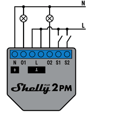
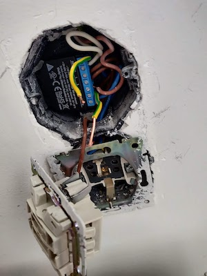

After powering on the device and setting up its WiFi we should update it's firmware as some options might not be available. The first thing we have to do is to setup property our device to be able to use our existing switches. This can be done through a bunch of setting at the Settings menu:

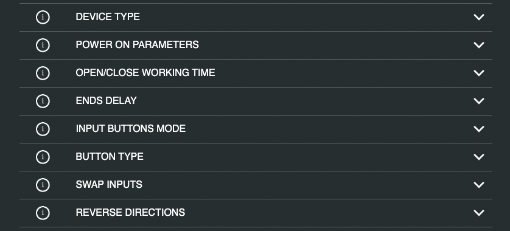

Then we can control our roller shutter directly from the Shelly's web interface: 

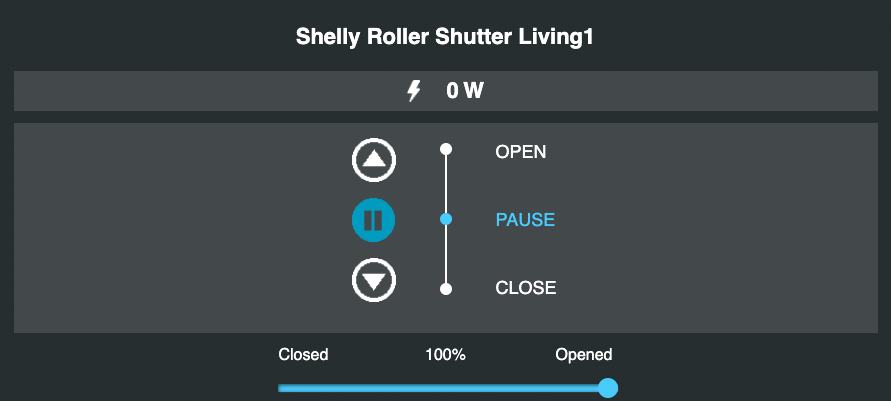

Another step is to calibrate the setting of the Shelly-2PM so that it can sense the exact position of the roller shutter and also allow us to control it more precisely. This can be done through the Position control of the settings:

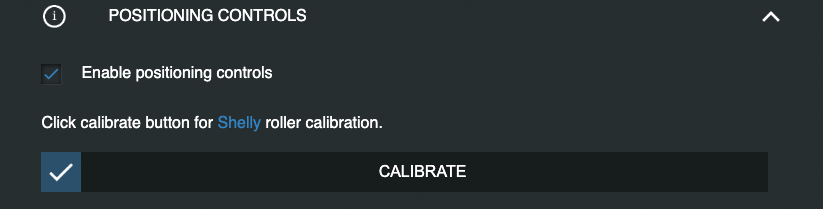

Pressing the Calibrate button will make the roller shutter to turn off and on several times. As a last step of the setup process could be to setup some safety options that the shelly provides. While some roller shutter incorporate such functionality we could also set it up within our shelly 2PM:

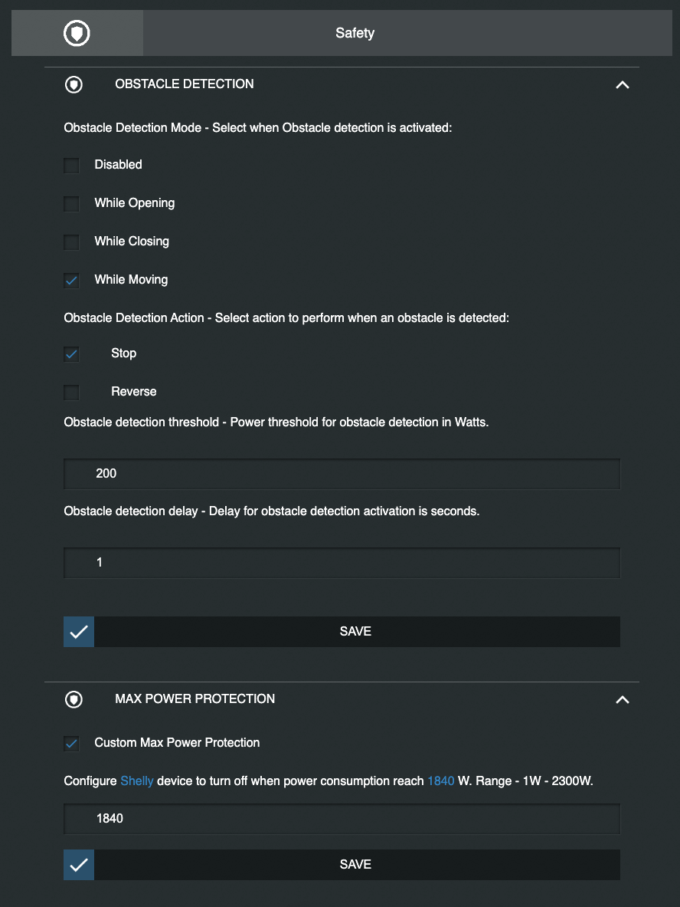

Now we can proceed to the HA in order to setup the device. After the successful setup we can integrate to any dashboard. The most common way to do it is to use a [HACS](https://hacs.xyz/) addon named [Shutter Card](https://github.com/Deejayfool/hass-shutter-card). This addon provides a UI element that allows the straight forward control of a roller shutter:

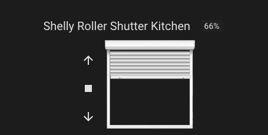

This UI element allows us to examine the roller shutter's position and also control from the buttons provides (arrows and stop button) as well as by dragging & dropping the roller shutter to the desired spot.
